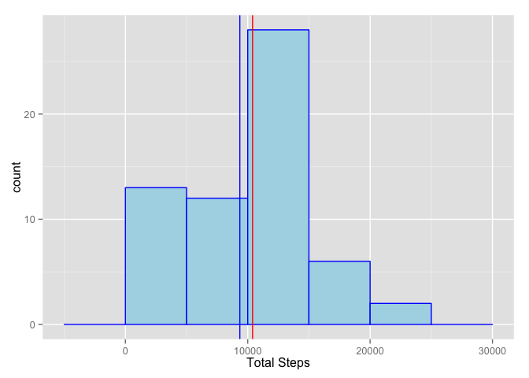
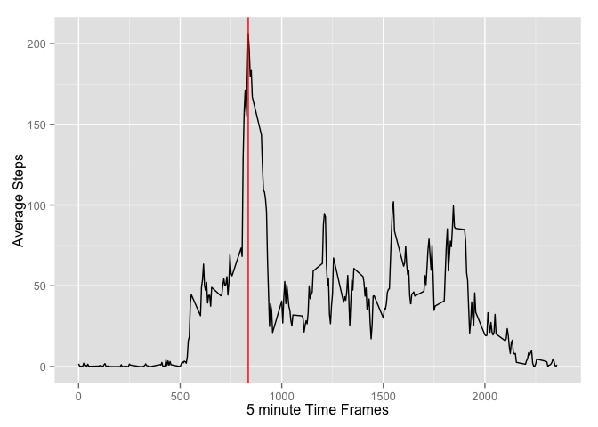
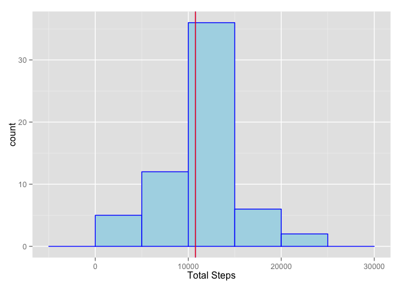
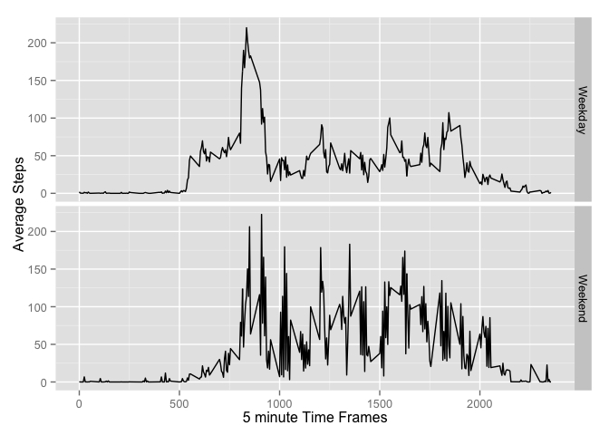

# Reproducible Research: Peer Assessment 1

## Loading and Preprocessing Data

The following code installs the requisite libraries, loads and preprocesses the
data.


```r
library(knitr)
library(dplyr)
library(ggplot2)
library(xtable)
library(lubridate)
#Personal Activity Monitoring - pam
pamData <- tbl_df(read.csv("activity.csv", stringsAsFactors = FALSE))
```

## What is the mean total number of steps taken per day?

The following code calculates the total number of steps per day, and makes a
histogram of the total number of steps taken each day.


```r
totalStep_byDay <- summarise(group_by(pamData,date),
                             TotalSteps = sum(steps, na.rm = TRUE))
g <- ggplot(totalStep_byDay, aes(x = TotalSteps))
g <- g + geom_histogram(color = 'blue', fill = 'lightblue',binwidth = 5000)
g <- g+xlab("Total Steps")

meanTotSteps <- round(mean(totalStep_byDay$TotalSteps),2)
medianTotSteps <- round(median(totalStep_byDay$TotalSteps),2)

g <- g + geom_vline(xintercept = meanTotSteps, colour = 'blue')
g <- g + geom_vline(xintercept = medianTotSteps, colour = 'red')
g
```

 


The mean and median of the total number of steps per day is
**9354.23** and **1.0395\times 10^{4}** respectively. As shown by the
blue and red vertical lines in the above histogram.

## What is the average daily activity pattern?

The following code creates a time series line graph of the average steps taken in
each 5 minute interval across the respective days.


```r
byGroup <- group_by(pamData, interval)
averageStep_byInterval <- summarise(byGroup,
                                    AveSteps = mean(steps, na.rm = TRUE))

g <- ggplot(averageStep_byInterval,
            aes( y = AveSteps, x = interval)) + geom_line()
g <- g+xlab("5 minute Time Frames") + ylab("Average Steps")

maxIndex <- which.max(averageStep_byInterval$AveSteps)
maxInterval <- averageStep_byInterval$interval[maxIndex]

g <- g + geom_vline(xintercept = maxInterval, colour = 'red')
g
```

 


The maximum average 5 min interval steps occurs at the **835** time
frame. Highlighted by the red vertical line in the above line graph.

## Imputing Missing Values

The following code calculates the number of rows with missing values.


```r
totalRecords <- nrow(pamData)
completeRecords <- sum(complete.cases(pamData))
missingRecords <- totalRecords - completeRecords
```

The number of missing records is: **2304**. The missing records
are required to be filled. Missing steps for an interval will be replaced by the
average number of steps for that interval. The following code does that. Further,
the code creates a new data set with the missing data filled.


```r
aveInt <- averageStep_byInterval
aveData <- sapply(pamData$interval,
                  FUN = function(x) { aveInt$AveSteps[aveInt$interval == x]})
replaceData <- ifelse(is.na(pamData$steps),
                      aveData, pamData$steps)
pamNewData <- pamData
pamNewData$steps <- replaceData
```

With the new data, a new histogram will be created showing the total number of steps
taken each day. This will include the calculation of the mean and median of this new
data set.


```r
totalNewStep_byDay <- summarise(group_by(pamNewData,date),
                             TotalSteps = sum(steps, na.rm = TRUE))
g <- ggplot(totalNewStep_byDay, aes(x = TotalSteps))
g <- g + geom_histogram(color = 'blue', fill = 'lightblue',binwidth = 5000)
g <- g+xlab("Total Steps")

meanNewTotSteps <- round(mean(totalNewStep_byDay$TotalSteps),2)
medianNewTotSteps <- round(median(totalNewStep_byDay$TotalSteps),2)

g <- g + geom_vline(xintercept = meanNewTotSteps, colour = 'blue')
g <- g + geom_vline(xintercept = medianNewTotSteps, colour = 'red')
g
```

 


The new mean and median for the total number of steps per day are
**1.076619\times 10^{4}** and **1.076619\times 10^{4}** respectively. As shown by the
blue and red vertical lines in the above histogram. The absolute and relative 
differences of the estimates are calculated next.


```r
meanDiff <- meanNewTotSteps - meanTotSteps
medianDiff <- medianNewTotSteps - medianTotSteps
meanRel <- paste0(round(100*meanDiff/meanTotSteps,digits = 2),"%")
medianRel <- paste0(round(100*medianDiff/meanTotSteps,digits = 2),"%")
```

The absolute differences are **1411.96** and **371.19** respectively
for the mean and median estimates. Likewise the relative differences which can be seen as the impact of replacing the missing values are **15.09%** and **3.97%**. Offhand it appears as a material impact as the histogram is centered around a bell curve creating equality between mean and median.

## Are there differences in activity patterns between weekdays and weekends?

First, a new factor variable is created indicating whether a day is a weekend or 
weekday.


```r
daysWeek <- ifelse(weekdays(ymd(pamNewData$date)) == c("Saturday","Sunday"),
                   "Weekend",
                   "Weekday")
daysWeek <- factor(daysWeek)
pamNewData <- mutate(pamNewData, weekDay = daysWeek)
byNewGroup <- group_by(pamNewData, interval, weekDay)
aveNewStep_byInterval <- summarise(byNewGroup, AveNewSteps = mean(steps))

g <- ggplot(aveNewStep_byInterval,
            aes( y = AveNewSteps, x = interval)) + geom_line()
g <- g+xlab("5 minute Time Frames") + ylab("Average Steps")
g <- g + facet_grid(weekDay~.)
g
```

 

From the graph produced, it appears that a lot more activity occurs on the weekend
when compared to the weekday. Which would be expected.
